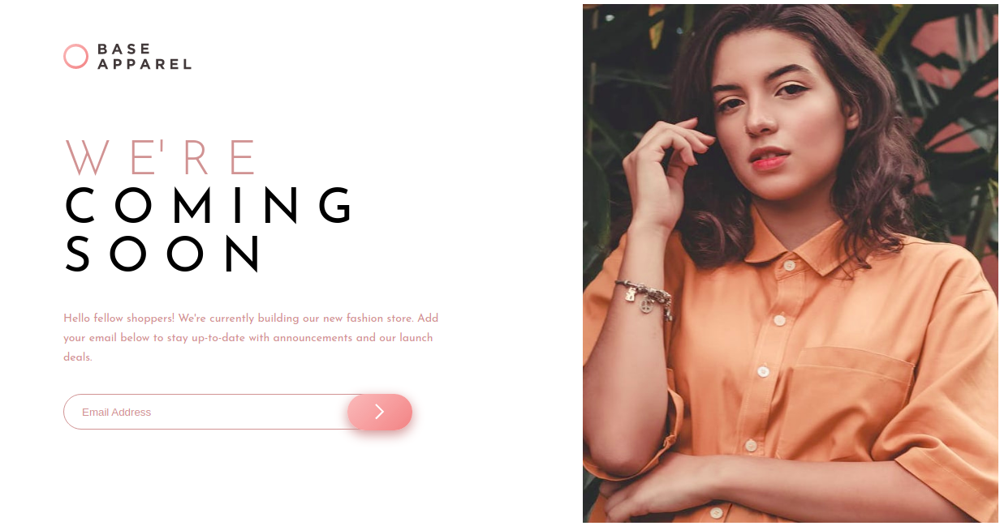
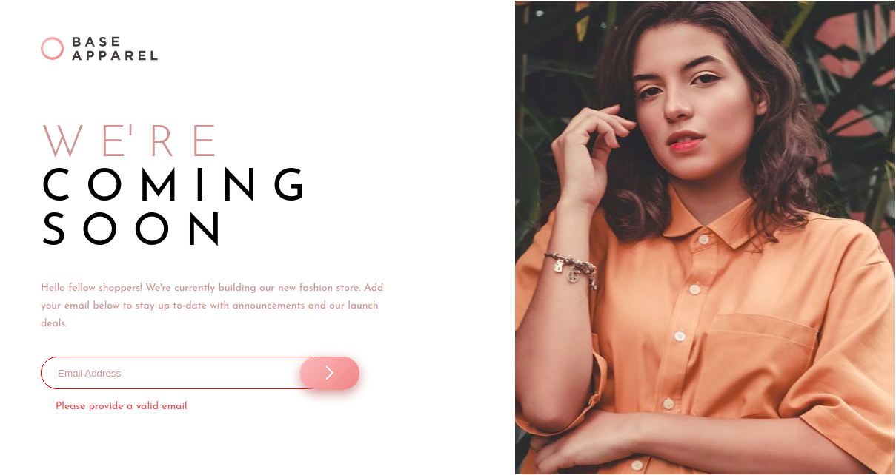

# Frontend Mentor - Base Apparel coming soon page

This is a solution to the [Base Apparel coming soon on Frontend Mentor]https://www.frontendmentor.io/challenges/base-apparel-coming-soon-page-5d46b47f8db8a7063f9331a0. Frontend Mentor challenges help you improve your coding skills by building realistic projects. 

## Overview

### The challenge

- Build out the project to the designs provided

### Screenshot 

### Links

- Live Site URL: [github-pages](https://dehfachini.github.io/base-apparel-coming-soon/)

## My process

### Built with

- Semantic HTML5 markup
- CSS custom properties
- Accordion made with vanilla JS

### To Do

- Mobile Design

## Author

- Website - [Débora](https://github.com/dehfachini)
- Frontend Mentor - [@dehfachini](https://www.frontendmentor.io/profile/dehfachini)

